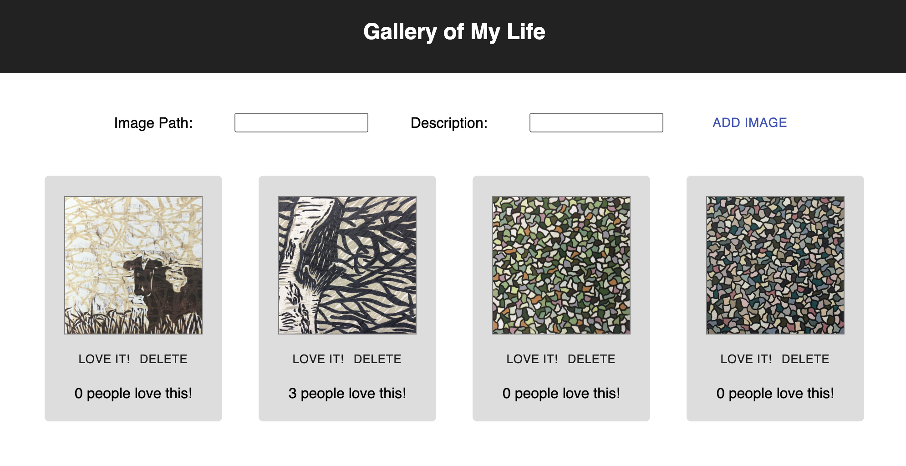

# Project Name

Gallery of My Life (Art Portfolio)

## Description

_Duration: Weekend solo project_

This project was my first integration of React.js and a full-stack architecture. The user can add new images by specifying their path and description, delete items from the database, and update the elements by upvoting them.

## Image

## Installation

1. Create a database named react-gallery
2. The queries in database.sql are set up to create the necessary table and populate it with some dummy data. The project is built on Postgres, so you will need to make sure to have that installed.
3. Open up your editor of choice and run `npm install`
4. Run `npm run server` in your terminal
5. Run `npm run client` in another terminal. This should open up a new browser tab.

Additional README details can be found [here](https://github.com/PrimeAcademy/readme-template/blob/master/README.md).

## Technologies used

- Node.js
- React.js
- Axios.js
- Express
- PostGres
- SweetAlert2

## Acknowledgement

- Thanks to Prime Digital Academy, my Amethyst cohort, and instructors Dane, Key, and Edan.
